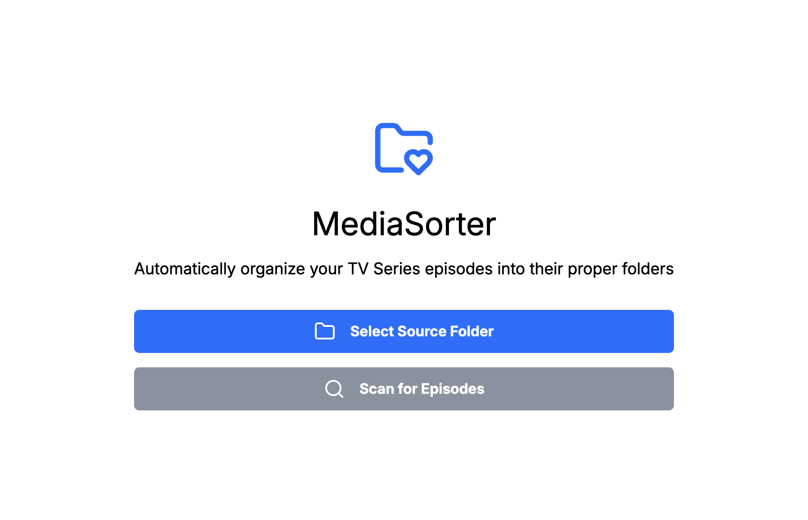
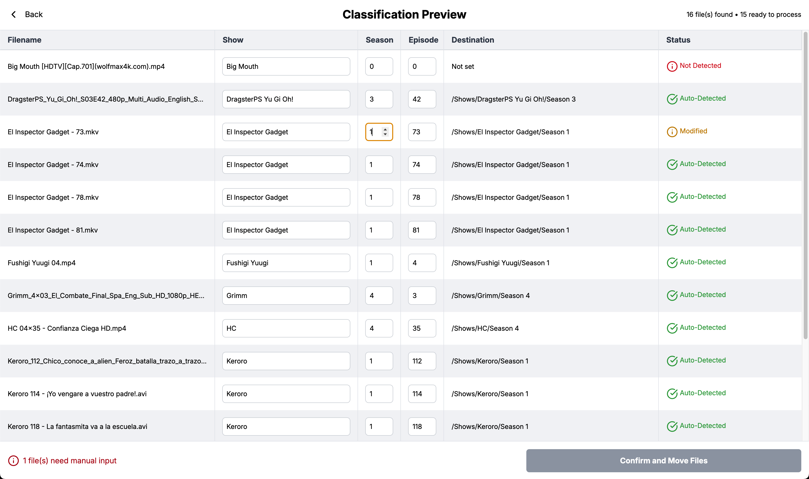
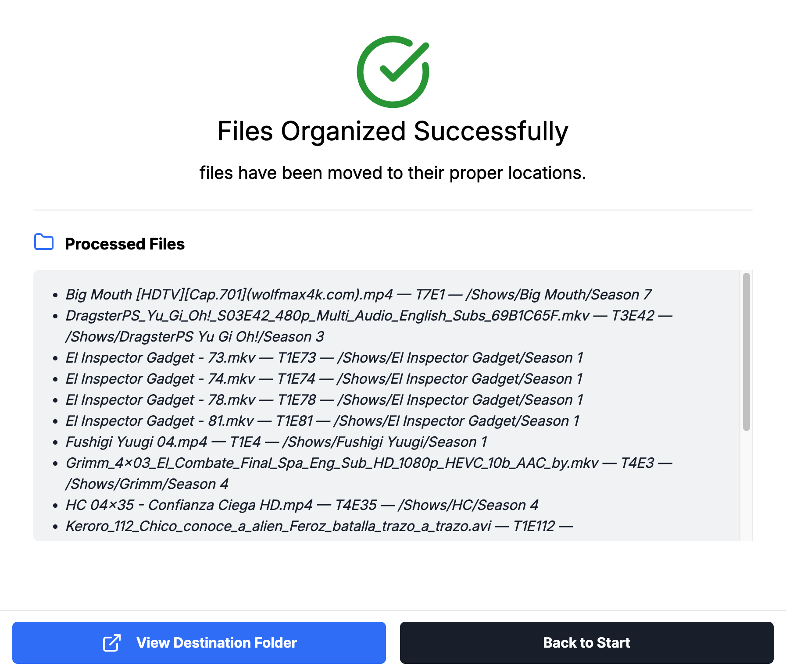

# 📦 MediaSorter
**Version: 1.0.0-beta.1**

**MediaSorter** is a desktop application built with **React + Electron** that automatically organizes your downloaded TV episodes. It scans your folders, detects the series and season from the filenames, and moves the episodes into structured folders for easy media library management.

Perfect for users of **Jellyfin**, **Plex**, or local collections.


## 🚀 Features

- Scan folders to detect video files automatically.
- Identify series name and season from the filenames.
- Organize episodes into folders like: `Series Name/Season X`.
- Preview how the files will be sorted before applying changes.
- Move the video files (they are not duplicated).
- Open the destination folder after sorting.
- Mark files as “Modified” if you adjust the information manually.
- User-friendly interface for easy navigation.
- Supports common video formats like `.mp4`, `.mkv`, `.avi`, and more.
- Automatically resizes the app window for better viewing depending on the screen.


## 🛠️ Tech Stack

- ⚛️ React
- ⚡ Electron
- 📦 Vite
- 📁 Node.js + fs for file operations
  

## 📷 Screenshots






## 📦 Getting Started (Development)

1. Clone the repository:

```bash
git clone https://github.com/srlsrx/mediaSorter.git
cd mediaSorter
```

2. Install dependencies:

```bash
npm install
```

3.	Initialize Tailwind config (only the first time, if not already present):
```bash
npx tailwindcss init -p
```

4. Start the development server:

```bash
npm run start
```


## 🗂️ Project Structure

```
📦 media-sorter
├── electron/                  # Electron backend (main process)
│   ├── ipc/                   # IPC handlers for communication
│   ├── main.js                # Entry point for Electron
│   └── preload.js             # Preload script for secure context bridging
├── public/                    # Static assets
│   └── fonts/                 # Custom fonts
├── src/                       # Frontend source code (React)
│   ├── App.jsx                # Root component
│   ├── App.css                # Global styles
│   ├── assets/                # Static assets (images, icons…)
│   ├── components/            # Reusable UI components
│   ├── hooks/                 # Custom React hooks
│   ├── index.css              # TailwindCSS + global styles
│   ├── main.jsx               # React entry point
│   ├── pages/                 # Page-level React components
│   ├── stores/                # Zustand global state stores
│   └── utils/                 # Utility/helper functions
├── index.html                 # HTML entry point for Vite
├── package.json               # Project metadata and dependencies
├── postcss.config.js          # PostCSS configuration
├── tailwind.config.js         # TailwindCSS configuration
└──vite.config.js              # Vite bundler configuration
```


## ✅ Status

✅ Beta — Core features implemented and working. Ongoing improvements planned.


## 📄 License


This project is licensed under the [MIT License](LICENSE).


## 📄 Changelog

You can find the full changelog in the [CHANGELOG.md](CHANGELOG.md) file.


## 🔮 Future Features

The following improvements are planned for future versions:

- [ ] Support for subtitle files (.srt)
- [ ] Improved series detection heuristics
- [ ] Interface for bulk metadata editing
- [ ] Integration with databases like TheTVDB or TMDB
- [ ] User-customizable configuration settings
- [ ] History log of performed operations
- [ ] Support for renaming files based on a defined pattern

---

**MediaSorter** — because organizing your shows shouldn't be a full-time job.
